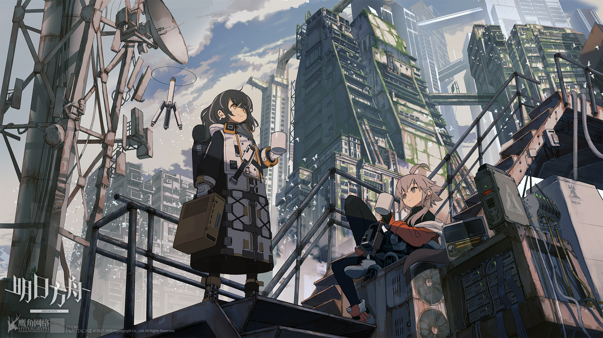

**WIP** [QOI image format](https://github.com/phoboslab/qoi) implemented in python.
This is a python practice project for myself to learn qoi format and try to write an python library.

## Useful resources
* [qoi image format](https://qoiformat.org)
* [qoir format](https://github.com/nigeltao/qoir), an fast, simple, lossless image format inspired by qoi format.
* [python bitwise operation](https://realpython.com/python-bitwise-operators/) tutorial.
* [introduction video](https://www.bilibili.com/video/BV1Wg411d7Kp) of png by [Reduciable](https://www.youtube.com/@Reducible) which explain the working mechanism of qoi format.

## Test cases



```shell
$tree --du -h
[ 13M]  .
├── [374K]  test.jpg
├── [5.9M]  test.npy
├── [3.5M]  test.png
└── [3.5M]  test.qoi

  13M used in 1 directory, 4 files
```

### Artist

Test image from [@video](https://www.bilibili.com/video/BV11z4y1X7V5/)

[](https://twitter.com/arcticcave)

## Prerequisite library

```shell
conda install numpy matplotlib
```

todo:
* [*] find a way to implement sign bit in python
* [*] check `pack_qoi_op_diff` and `pack_qoi_op_luma` function
* [ ] check qoi end marker when reaching the last pixel
* [ ] support rgba images
* [ ] add error checking when pixel value overflows
* [ ] make it python library
