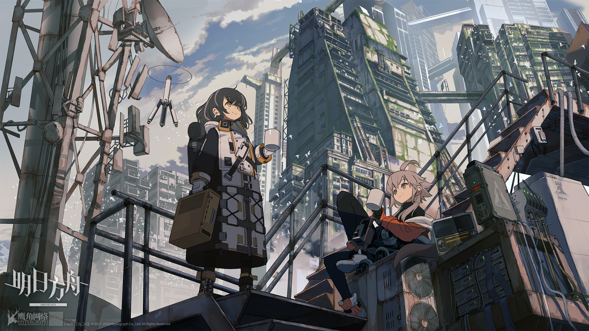

**WIP** [QOI image format](https://github.com/phoboslab/qoi) implemented in python.
This is a python practice project for myself to learn qoi format and try to write an python library.

## Useful resources
* [qoi image format](https://qoiformat.org)
* [qoir format](https://github.com/nigeltao/qoir), an fast, simple, lossless image format inspired by qoi format.
* [python bitwise operation](https://realpython.com/python-bitwise-operators/) tutorial.
* [introduction video](https://www.bilibili.com/video/BV1Wg411d7Kp) of png by [Reduciable](https://www.youtube.com/@Reducible) which explain the working mechanism of qoi format.

## Test cases



```shell
# make sure you have the dependencies installed
$python3 test_qoi.py
$tree --du -h ./output/
[ 13M]  .
├── [374K]  test.jpg
├── [5.9M]  test.npy
├── [3.5M]  test.png
└── [3.5M]  test.qoi

  13M used in 1 directory, 4 files
```

### Artist

Test image from [@video](https://www.bilibili.com/video/BV11z4y1X7V5/)

[](https://twitter.com/arcticcave)

## Prerequisite library

```shell
conda install numpy matplotlib
```

## Optimization status

The optimization plan in this repo has been completed through Phase 5.

### Final validation snapshot

Measured with:

```sh
./.venv/Scripts/python.exe bench_qoi.py --repeats 3 --warmups 1
```

| case | encoded size | encode mean | decode mean |
|---|---:|---:|---:|
| photographic_rgb | 3.44 MiB | 986.467 ms | 816.267 ms |
| flat_regions | 5.53 KiB | 18.294 ms | 10.941 ms |
| small_sanity | 53 B | 0.413 ms | 0.206 ms |

### Improvements vs baseline

- photographic RGB:
  - encode: `9493.805 ms -> 986.467 ms` (`9.62x` faster)
  - decode: `5940.218 ms -> 816.267 ms` (`7.28x` faster)
- flat regions:
  - encode: `191.536 ms -> 18.294 ms` (`10.47x` faster)
  - decode: `17.123 ms -> 10.941 ms` (`1.57x` faster)
- small sanity:
  - encode: `1.349 ms -> 0.413 ms` (`3.27x` faster)
  - decode: `0.598 ms -> 0.206 ms` (`2.90x` faster)

### Current support

- RGB encode/decode: supported
- RGBA encode/decode: explicitly unsupported for now
- Unit tests: `32` passing tests under `tests/test_qoi_unittest.py`

### Optimization notes folder

All benchmark and validation notes are now collected under:

- `docs/optimization/`

Contents:
- `docs/optimization/PHASE0_BASELINE.md`
- `docs/optimization/PHASE1_RESULTS.md`
- `docs/optimization/PHASE2_RESULTS.md`
- `docs/optimization/PHASE3_RESULTS.md`
- `docs/optimization/PHASE4_RESULTS.md`
- `docs/optimization/PHASE5_RESULTS.md`
- `docs/optimization/FINAL_VALIDATION.md`
